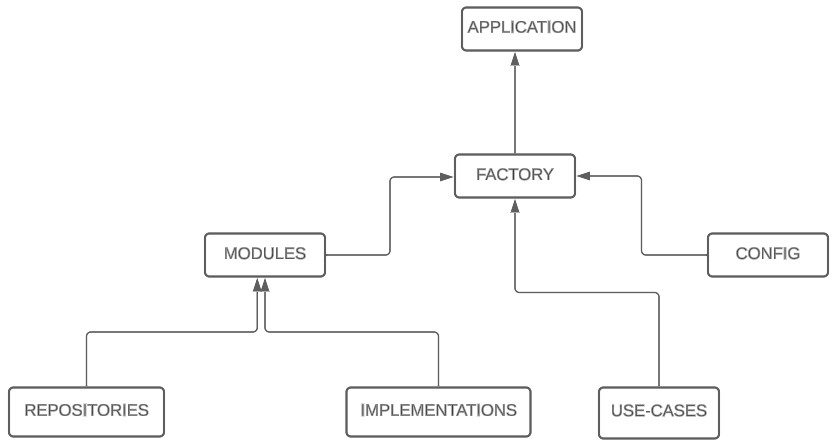

# boilerplate-web3js

## Inspiration

A response to the need to avoid code duplication across multiple web3.js projects. Simplifying development and promoting module reuse for different projects.

## What does it mean?

First of all, let's go to [Wikipedia](https://en.wikipedia.org/wiki/SOLID) to understand the organizational essence.

## Did you saw that? Now you can continue

## Requirements

Before running the application, make sure you have the following requirements installed:

- Node.js version v18.12.1
- NPM version v8.19.2

## How to execute

Follow the steps below to run the application:

1. Clone this repository to your local machine.
2. Navigate to the project's root directory.
3. Run the command npm install or yarn install to install the dependencies.
4. Follow the instructions in each module to run and test them individually.

## Contribute

Contributions are welcome! If you wish to contribute to this project, please follow the guidelines below:

1. Fork this repository.
2. Create a branch with a descriptive name for your contribution.
3. Make the necessary changes and additions.
4. Submit a pull request for review.

## License

This project is licensed under the [MIT](LICENSE).
